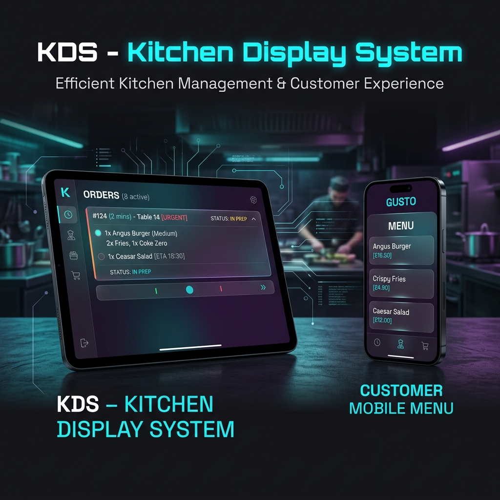
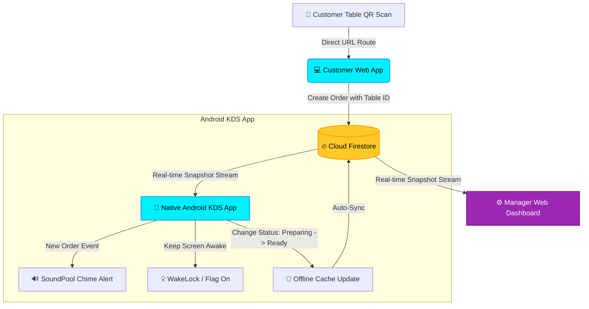

# 🍳 KDS — Kitchen Display & Table-Side Ordering System

[](https://kotlinlang.org)
[](https://developer.android.com/jetpack/compose)
[](https://react.dev)
[](https://vite.dev)
[](https://firebase.google.com)
[](https://opensource.org/licenses/MIT)

A high-performance, real-time Kitchen Display System (KDS) and Table-Side Ordering monorepo ecosystem. This enterprise-grade solution connects restaurant tables directly to the back-of-house kitchen staff and front-of-house management, leveraging a high-speed, synchronized serverless architecture.



🎬 **[Watch the High-Fidelity KDS Video Demonstration (MP4)](https://github.com/adksoftwares/KDS/raw/main/assets/kds_demo.mp4)**

---

## 🌟 Project Ecosystem

The KDS project consists of three tightly coupled modules serving distinct user personas:

### 📱 1. Native Android KDS Tablet App
*A native Android client tailored specifically for kitchen tablets, engineered for long shifts, high-volume kitchen noise, and spotty restaurant WiFi.*
- **Unidirectional Compose UI:** Powered by Jetpack Compose, built with highly legible, high-contrast ticket cards featuring automatic duration timers and color-coded status queues.
- **SoundPool Alerts:** A high-speed audio notification system that bypasses typical Android `MediaPlayer` latency to play high-decibel chime alerts whenever a new order is received.
- **Awake Locks:** Configured with keep-screen-on flags (`FLAG_KEEP_SCREEN_ON`) so tablets remain active and never sleep mid-service.
- **Firestore Caching:** Configured with full offline persistence so kitchen staff can continue to view and update tickets during temporary internet dropouts, auto-syncing back as soon as connectivity resumes.

### 💻 2. Customer Web Ordering App
*A lightweight, ultra-responsive customer web application accessed via QR codes located at tables.*
- **Table Routing:** Automatically parses dynamic table IDs (`/customer/:table_id`) to map orders to the correct customer table.
- **Anonymous Session Handshakes:** Leverages Firebase Anonymous Authentication to secure orders immediately without requiring slow user registrations.
- **Intuitive Menu Browser & Cart:** Dynamic shopping cart with custom line-item notes (e.g. *"no onions"*, *"extra sauce"*).

### ⚙️ 3. Manager Web Dashboard
*An operations cockpit for restaurant managers to track efficiency metrics, control menus, and manage staff.*
- **Live Statistics:** Monitors active kitchen queues, average order completion times, and overall sales metrics.
- **Menu Editor:** Real-time toggling of dish availability, descriptions, pricing, and images.
- **Staff Accounts Management:** Secure role control to add or revoke access for line cooks and cashiers.

---

## 🏗️ Architecture & Data Flow



---

## ⚙️ Engineering & Architecture Deep Dive

### 1. Reliable Kitchen Chimes via SoundPool
Standard `MediaPlayer` inside Android is designed for heavy media playback (e.g., songs/movies) and introduces noticeable resource-loading overhead and latency. KDS utilizes a customized **SoundPool** interface, perfect for short sound clips (like the kitchen order chime):
- **Pre-loaded Samples:** Sounds are loaded into memory asynchronously on app start.
- **Non-blocking Execution:** Triggering plays is incredibly fast (< 20ms) and runs on a separate audio thread.
- **Concurrent streams:** Prevents audio clipping if multiple orders arrive simultaneously.

```kotlin
// Pre-loaded in MainActivity for near-zero latency
soundPool = SoundPool.Builder()
    .setMaxStreams(3)
    .setAudioAttributes(audioAttributes)
    .build()
    .also { pool ->
        chimeSoundId = pool.load(this, R.raw.chime, 1)
    }

// Played with zero UI thread impact
soundPool?.play(chimeSoundId, 1.0f, 1.0f, 1, 0, 1.0f)
```

### 2. Resilient Offline Firestore Persistence
Restaurant kitchens are notorious for thick walls, metal refrigerators, and dead zones. KDS configures the Android Firestore SDK to run with **Local Data Caching** enabled:
```kotlin
private val firestore = FirebaseFirestore.getInstance().apply {
    firestoreSettings = FirebaseFirestoreSettings.Builder()
        .setPersistenceEnabled(true) // Enables resilient SQLite local storage
        .build()
}
```
All UI queues are backed by reactive Jetpack Compose `StateFlow` structures connected to Firestore's local SQLite cache database. Cooks can check off items even when offline—updates are immediately reflected locally and queued up for server synchronizations.

### 3. Transforming Callback Listeners into Reactive Flows
To connect Firestore's real-time document listeners to Kotlin's state flow pipelines, the Android client uses `callbackFlow` to easily transform active socket channels into clean coroutines:
```kotlin
fun observeActiveOrders(): Flow<List<Order>> = callbackFlow {
    val subscription = ordersCollection
        .whereIn("status", listOf("pending", "preparing"))
        .addSnapshotListener { snapshot, error ->
            if (error != null) {
                close(error)
                return@addSnapshotListener
            }
            if (snapshot != null) {
                val orders = snapshot.documents.mapNotNull { it.toObject(Order::class.java)?.copy(id = it.id) }
                trySend(orders)
            }
        }
    awaitClose { subscription.remove() } // Cleanup on stream closure
}
```

---

## 📂 Project Directory Mapping

```text
KDS/ (Monorepo Root)
├── assets/                     # Portfolio assets & branding banner
├── android/                    # Native Android Mobile App
│   ├── app/
│   │   ├── src/main/java/      # Kotlin source files
│   │   │   └── com/kds/kitchen/
│   │   │       ├── data/       # Order data models & Firestore repository
│   │   │       ├── ui/         # Jetpack Compose Screens & TicketCard design
│   │   │       └── viewmodel/  # Kitchen view model state handlers
│   │   └── src/main/res/raw/   # Chime sound resources
│   ├── build.gradle
│   └── settings.gradle
├── src/                        # Web Dashboard & Ordering App
│   ├── components/             # Reusable UI widgets (Cart, Menu items)
│   ├── pages/
│   │   ├── customer/           # Customer Ordering Portal
│   │   ├── kitchen/            # Web fallback KDS client
│   │   └── manager/            # Manager settings, profiles, & login
│   ├── services/               # Firestore integration & Authentication
│   ├── App.jsx                 # Routing configuration
│   └── index.css               # Premium CSS variables & global styling
├── package.json
└── firebase.json               # Firebase Firestore indexing & hosting configuration
```

---

## ⚡ Getting Started

### Prerequisites
- [Node.js](https://nodejs.org/) (v18+)
- [Android Studio Jellyfish](https://developer.android.com/studio) or newer
- A [Firebase Project](https://console.firebase.google.com/) with **Firestore Database** and **Anonymous Authentication** enabled.

---

### 💻 Part 1: React Web Application Setup

1. **Clone & Navigate:**
   ```bash
   cd KDS
   ```

2. **Install Dependencies:**
   ```bash
   npm install
   ```

3. **Configure Environment Variables:**
   Create a `.env` file at the root of the project and add your Firebase configuration credentials:
   ```env
   VITE_FIREBASE_API_KEY=your_api_key
   VITE_FIREBASE_AUTH_DOMAIN=your_auth_domain
   VITE_FIREBASE_PROJECT_ID=your_project_id
   VITE_FIREBASE_STORAGE_BUCKET=your_storage_bucket
   VITE_FIREBASE_MESSAGING_SENDER_ID=your_sender_id
   VITE_FIREBASE_APP_ID=your_app_id
   ```

4. **Launch Dev Server:**
   ```bash
   npm run dev
   ```
   *The Customer portal will launch on `http://localhost:5173/customer/table_1`.*

---

### 📱 Part 2: Native Android Application Setup

1. **Open in Android Studio:**
   Launch Android Studio and choose **Open an existing project**, then select the `android` folder (`KDS/android`).

2. **Add Google Services Config:**
   Download your `google-services.json` from the Firebase Console and place it into the `KDS/android/app/` directory.

3. **Res/Raw Sound Setup:**
   Ensure you have a short notification mp3 sound named `chime.mp3` inside `KDS/android/app/src/main/res/raw/`.

4. **Build & Run:**
   Sync Gradle files and click the **Run** button to deploy the app onto a kitchen tablet or emulator.

---

## 🛡️ License

This project is licensed under the MIT License - see the [LICENSE](LICENSE) file for details.
